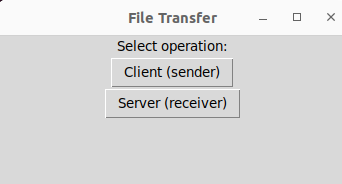
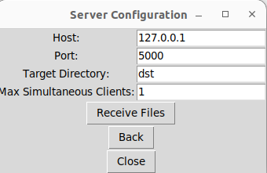
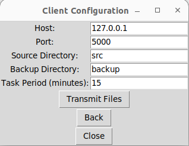

# Periodic Backup

## Overview
This project consists of three Python scripts for implementing a periodic backup system in a client-server architecture. The client.py script sends files from a specified directory to a server implemented in the server.py script. The main.py script provides a graphical user interface (GUI) for configuring and running the client and server components.

## Files
1. **client.py**: This script establishes a connection with the server and sends files from a specified directory. It handles file transmission by sending file metadata (name, size) followed by the file contents. Additionally, it manages the creation of backup files for successfully transmitted files.

2. **server.py**: Acting as the server, this script listens for incoming connections from clients. Upon connection, it receives files sent by clients along with their metadata (name, size) and saves them to a specified directory.

3. **main.py**: This script provides a GUI interface for configuring and running the client and server components. It utilizes the tkinter library for the graphical interface, allowing users to select client or server configurations.


## Usage

Before running the client, ensure that the server instance is running to receive files. Follow these steps to execute the application:

## Listener

1. Launch the main GUI interface by executing:

```bash
python3 main.py
```

2. In the GUI, select the **Server (receiver)** option and configure file receiver.



3. Enter the required information such as host, port, target directory and maximum number of simoultaneous clients and click on **Receive Files**:





## Sender

1. Launch the main GUI interface by executing:

```bash
python3 main.py
```

2. In the GUI, select the **Client (sender)** option to configure and initiate file transmission.


3. Enter the required information such as host, port, source directory, backup directory, and task period (minutes) and finally click on **Transmit Files**:




4. After this steps it will start the backup process. Ensure that the server is running and ready to receive files.


## Dependencies

- Python 3.x
- tkinter (Python's standard GUI library)

## Notes

- Ensure the server instance (receiver) is operational before starting the client to facilitate successful file transmission.
- Validate directory permissions to ensure smooth file read/write operations.
- Check for any network errors to maintain uninterrupted file transmission.